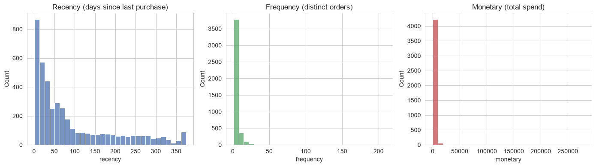
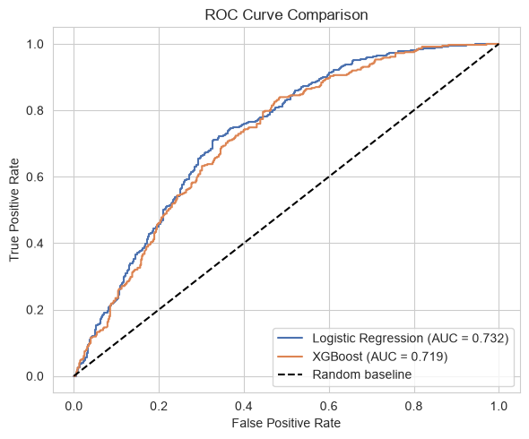

<div align="center">

# 📊 E-Commerce Customer Retention & Lifetime Value Optimization

**End-to-end data analytics pipeline — SQL · Python · Machine Learning · Streamlit**

[](https://www.python.org/)
[](https://www.mysql.com/)
[](https://streamlit.io/)
[](https://scikit-learn.org/)
[](https://opensource.org/licenses/MIT)

[Overview](#-overview) · [Features](#-key-features) · [Tech Stack](#-tech-stack) · [Getting Started](#-getting-started) · [Results](#-results) · [Methodology](#-methodology)

</div>

---

## 🎯 Overview

This project delivers an **end-to-end analytics solution** for an e-commerce business facing two critical retention challenges:

- 📈 **Customer Acquisition Cost (CAC) up 22%** over the past 3 quarters
- 📉 **90-day repeat purchase rate down 14%** over the same period

The analysis identifies churn drivers, segments customers using RFM methodology, tracks cohort retention, and deploys a machine learning model that predicts at-risk customers — all surfaced through an interactive Streamlit dashboard for the retention team.

**Dataset:** [UCI Online Retail II](https://archive.ics.uci.edu/dataset/502/online+retail+ii) — 541,909 raw transactions from a UK-based online gift retailer (Dec 2009 – Dec 2010).

---

## ✨ Key Features

### 🔍 Data Pipeline
- **SQL Cleaning** — Removes null customers, cancellations, and invalid quantities
- **RFM Segmentation** — Champions, At Risk, New/Casual, Lost
- **Cohort Retention Matrix** — 12-month tracking by acquisition month
- **Leakage-Free Churn Labels** — Strict time-split between features and holdout window

### 🤖 Machine Learning
- **Logistic Regression** (selected model) — ROC-AUC **0.732**
- **XGBoost** (comparison) — ROC-AUC **0.719**
- Full model diagnostics — confusion matrices, ROC curves, feature importance

### 📊 Interactive Dashboard
- Real-time KPI cards (customers, revenue, churn rate, AOV)
- Segment distribution & RFM scatter plots
- Cohort retention heatmap with decay curve
- **Live churn risk predictor** — enter any customer's metrics, get instant probability
- **Customer lookup** — search by ID, view full profile
- Export reports as CSV

---

## 🛠 Tech Stack

| Layer | Technologies |
|---|---|
| **Database** | MySQL 8.0, SQL (window functions, CTEs, joins) |
| **Data Processing** | Python 3.12, pandas, NumPy |
| **Machine Learning** | scikit-learn, XGBoost |
| **Visualization** | Plotly, matplotlib, seaborn |
| **Dashboard** | Streamlit |
| **Database Access** | SQLAlchemy, PyMySQL, python-dotenv |
| **Environment** | Jupyter, VS Code |

---

## 📁 Project Structure

```
ECommerce_Retention_LTV_Project/
│
├── 1_SQL/                          # SQL transformation scripts
│   ├── 01_cleaning_and_rfm.sql
│   ├── 02_cohort_retention.sql
│   ├── 03_churn_features_labels.sql
│   └── 04_schema_normalization.sql
│
├── 2_Notebooks/                    # Analysis & modeling
│   ├── 00_import_to_mysql.py       # Bulk CSV → MySQL
│   ├── 01_export_from_mysql.py     # MySQL → CSV
│   ├── churn_analysis.ipynb        # EDA + ML pipeline
│   └── outputs/                    # Generated plots
│       ├── buyer_type.png
│       ├── cohort_heatmap.png
│       ├── confusion_matrix_lr.png
│       ├── confusion_matrix_xgb.png
│       ├── feature_importance.png
│       ├── rfm_correlation.png
│       ├── rfm_distributions.png
│       └── roc_curves.png
│
├── Data/                           # Data storage (gitignored)
│   ├── raw/                        # Original CSVs
│   ├── processed/                  # Cleaned CSVs
│   └── models/                     # Trained churn_model.pkl
│
├── Dashboard/
│   └── app.py                      # Streamlit dashboard
│
├── Docs/
│   ├── methodology.md              # Technical approach
│   ├── data_dictionary.md          # Column definitions
│   └── limitations.md              # Known constraints
│
├── Reports/
│   └── executive_summary.md        # Business summary
│
├── .env.example                    # Credentials template
├── .gitignore
├── requirements.txt
└── README.md
```

---

## 🚀 Getting Started

### Prerequisites
- Python 3.10+
- MySQL 8.0+
- Git

### 1. Clone the repository
```bash
git clone https://github.com/ThAnalyser/ECommerce_Retention_LTV_Project.git
cd ECommerce_Retention_LTV_Project
```

### 2. Install dependencies
```bash
pip install -r requirements.txt
```

### 3. Configure database credentials
```bash
cp .env.example .env
```

Edit `.env` with your local MySQL credentials:
```env
MYSQL_USER=root
MYSQL_PASS=your_password
MYSQL_HOST=localhost
MYSQL_PORT=3306
MYSQL_DB=ecommerce_retention
```

> ⚠️ **Never commit the `.env` file** — it's already listed in `.gitignore`.

### 4. Set up the database
```sql
CREATE DATABASE ecommerce_retention;
```

Then run the SQL scripts in order:
```bash
mysql -u root -p ecommerce_retention < 1_SQL/01_cleaning_and_rfm.sql
mysql -u root -p ecommerce_retention < 1_SQL/02_cohort_retention.sql
mysql -u root -p ecommerce_retention < 1_SQL/03_churn_features_labels.sql
mysql -u root -p ecommerce_retention < 1_SQL/04_schema_normalization.sql
```

### 5. Run the dashboard
```bash
cd Dashboard
streamlit run app.py
```

Open **http://localhost:8501** in your browser.

---

## 📊 Results

### Customer Segmentation

| Segment | Description |
|---|---|
| 🟢 **Champions** | Recent + high value — protect and reward |
| 🟠 **At Risk** | Previously high value, now lapsing — win-back priority |
| 🔵 **New / Casual** | Recent but low value — nurture for 2nd purchase |
| 🔴 **Lost** | Low value, inactive — deprioritize |

### Model Performance

| Model | Accuracy | ROC-AUC |
|---|---|---|
| **Logistic Regression** | ~73% | **0.732** ✅ |
| XGBoost | ~72% | 0.719 |

**Selected model:** Logistic Regression — simpler, more interpretable, and matches XGBoost on this dataset.

### Key Insights
- **Retention drops ~60% within the first month** after acquisition
- **One-time buyers** represent a significant share of the customer base
- **Champions drive the bulk of revenue** — retention here has the highest ROI
- **Frequency and recency** are the strongest churn predictors

---

## 📸 Screenshots

### RFM Distributions


### Cohort Retention Heatmap


### Model Performance


---

## 🔬 Methodology

### 1. Data Cleaning
- Removed transactions with null CustomerID (~23% of raw data)
- Filtered out cancellations (invoices starting with 'C')
- Removed returns (negative quantity) and free items (zero price)

### 2. RFM Analysis
- **Recency** — days since last purchase
- **Frequency** — distinct invoice count
- **Monetary** — total lifetime spend

### 3. Cohort Retention
- Grouped customers by first purchase month
- Tracked % still buying N months after joining

### 4. Churn Definition (Leakage-Free)
- **Holdout window:** Last 90 days of dataset
- **Features:** Computed only from pre-holdout period
- **Label:** 1 if no transaction during holdout

---

## ⚠️ Known Limitations

- **Subset used:** Only 2009-2010 data (541,909 rows). Full dataset extends to 2011.
- **90-day churn window:** The business brief specified 30 days, but 90 days provides a more meaningful "active" signal at this sample size.
- **Small sample for ML:** 3,370 customers in the modeling dataset. The pipeline scales cleanly to larger datasets.

See [`Docs/limitations.md`](Docs/limitations.md) for details.

---

## 🎁 Future Enhancements

- [ ] Add SHAP explanations for model interpretability
- [ ] Deploy to Streamlit Cloud with a live URL
- [ ] Integrate full 1M+ row dataset
- [ ] Add automated retraining pipeline
- [ ] Build cohort comparison tool (compare any 2 cohorts)

---

## 🤝 Contributing

This is a portfolio project, but feedback is welcome! Open an issue or submit a pull request.

---

## 📄 License

This project is licensed under the MIT License — see the [LICENSE](LICENSE) file for details.

---

## 👤 Author

**Raja Hanzala Muavia**
Data Analyst | SQL · Python · Power BI

- GitHub: [@ThAnalyser](https://github.com/ThAnalyser)
- Email: hanzalaraia74@gmail.com

---

<div align="center">

⭐ **If you found this project helpful, give it a star!** ⭐

Built with ❤️ using SQL, Python, and Streamlit

</div>